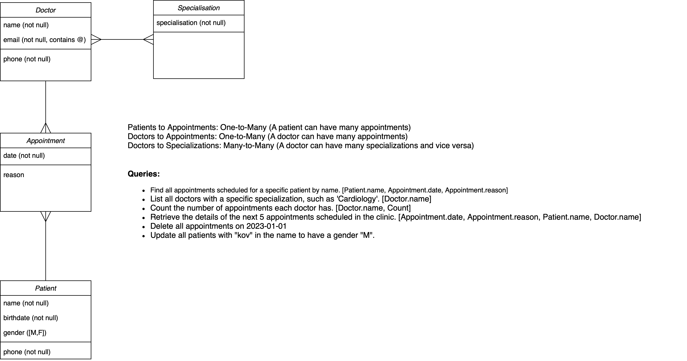

# Add this to your code at the top

```
SET SQL_SAFE_UPDATES=0;
```



This data is only dummy data, it is not real. It can be different from what fields are needed. It is only there to help you get idea for names, dates, ages and etc.

- **Teams**:
  - Team Name: Dragons, Coach Name: Sarah Connor, Founded Year: 1998, Home City: Metropolis
  - Team Name: Warriors, Coach Name: John Smith, Founded Year: 2003, Home City: Gotham

- **Players**:
  - Player Name: Mike Johnson, Age: 25, Position: Forward, Team: Dragons
  - Player Name: Alex Green, Age: 22, Position: Goalkeeper, Team: Warriors

- **Training Sessions**:
  - Session Date: 2024-05-15, Time: '10:00', Location: Metropolis Training Ground, Team: Dragons
  - Session Date: 2024-05-16, Time: '09:00', Location: Gotham City Field, Team: Warriors

- **Massages**:
  - Appointment Date: 2024-05-15, Time: '14:00', Player: Mike Johnson, Therapist: Emily White
  - Appointment Date: 2024-05-16, Time: '15:00', Player: Alex Green, Therapist: John Davis