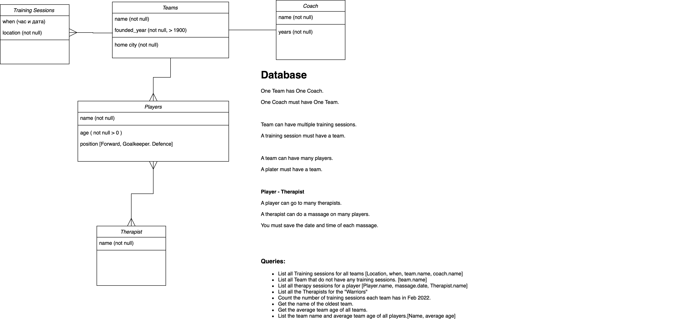

# Add this to your code at the top

```
SET SQL_SAFE_UPDATES=0;
```



## Database

- One Team has One Coach.
- One Coach must have One Team.
- Team can have multiple training sessions.
- A training session must have a team.
- A team can have many players.
- A plater must have a team.

### Player - Therapist

- A player can go to many therapists.
- A therapist can do a massage on many players.
- You must save the date and time of each massage.


## Queries:

- List all Training sessions for all teams [Location, when, team.name, coach.name]
- List all Team that do not have any training sessions. [team.name]
- List all therapy sessions for a player [Player.name, massage.date, Therapist.name]
- List all the Therapists for the "Warriors"
- Count the number of training sessions each team has in Feb 2022.
- Get the name of the oldest team.
- Get the average team age of all teams.
- List the team name and average team age of all players.[Name, average age]

This data is only dummy data, it is not real. It can be different from what fields are needed. It is only there to help you get idea for names, dates, ages and etc.

- **Teams**:
  - Team Name: Dragons, Coach Name: Sarah Connor, Founded Year: 1998, Home City: Metropolis
  - Team Name: Warriors, Coach Name: John Smith, Founded Year: 2003, Home City: Gotham

- **Players**:
  - Player Name: Mike Johnson, Age: 25, Position: Forward, Team: Dragons
  - Player Name: Alex Green, Age: 22, Position: Goalkeeper, Team: Warriors

- **Training Sessions**:
  - Session Date: 2024-05-15, Time: '10:00', Location: Metropolis Training Ground, Team: Dragons
  - Session Date: 2024-05-16, Time: '09:00', Location: Gotham City Field, Team: Warriors

- **Massages**:
  - Appointment Date: 2024-05-15, Time: '14:00', Player: Mike Johnson, Therapist: Emily White
  - Appointment Date: 2024-05-16, Time: '15:00', Player: Alex Green, Therapist: John Davis